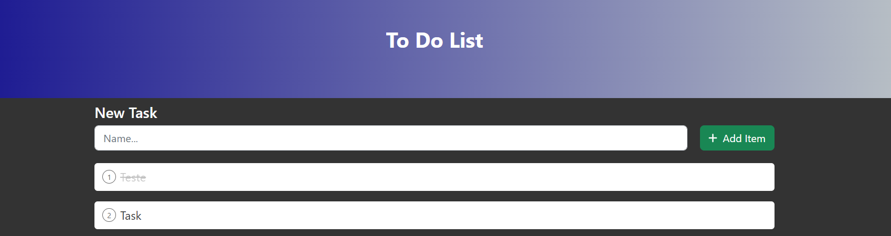

<div align="center">

  
  <h1><strong> ToDo List </strong></h1>
  
  
  
  

  **É um projetinho bem bacana de lista de tarefas 📃**
  
  

</div>

<h2> 📚 About</h2>

Esse projeto se trata de uma lista de tarefas para organização, com suas funcionalidades básicas.

Este projeto é composto de backend e frontend integrados por uma API disponibilizada pelo backend.

Construido usando react e javascript no front e java com springboot no back.

<h2> 🛠 Tecnologias </h2>

- ☕ Java
- 🍃 Spring
- 💾 Banco de dados H2 para teste
- 💾 Banco de dados postgres
- ⚛️ ReactJS
- 🆙 JavaScript

<h2> 📑 Features </h2>

- Exibição continua da lista de tarefas
- Botão Check para marcar ou desmarcar como finalizado
- Botão de para editar a descriçao da tarefa
- O frontend atualiza tudo dinâmicamente do banco de dados do banckend
- Botão de exclusão de tarefas

<h2> 🔥 Começando a usar </h2>

**Node (NPM)**
```
npm install
npm start
```
**Yarn**
```
yarn
yarn start
```

<h2> ⚙ Pré-requisitos </h2>

Para executar este projeto você deve ter [Nodejs](https://nodejs.org/) instalado em sua máquina.

O gerenciador de pacotes [Yarn](https://yarnpkg.com/) é opcional. Baseado no NPM, é um pouco diferente em alguns fatores, melhorando alguns problemas que o NPM teria. 
Mas pode optar por usar o NPM sem problemas. Você precisa executar o `npm start` pelo terminal na pasta do projeto. 

<h2> 🤝🏼 Contribuições </h2>

Qualquer contribuição que fizerem será muito bem-vinda.

1. 🍴 Fork the Project
2. 👯 Clone this project (`git clone https://github.com/Daniels-hc/dsmeta.git`)
3. 🔀 Create your Feature Branch (`git checkout -b my-feature`)
4. ✔️ Commit your Changes (`git commit -m 'feat: My new feature'`)
5. 📌 Push to the Branch (`git push origin my-feature`)
6. 🔁 Open a Pull Request

<h2> 📫 Contact </h2>

 [](https://www.linkedin.com/in/daniel-silva-63ab81203/)&nbsp;
 [](daniels.dev7@gmail.com)
 
 
 <!--
# 📜 License
This project is under **MIT License**. Check `LICENSE` for more details.
-->
  
  
